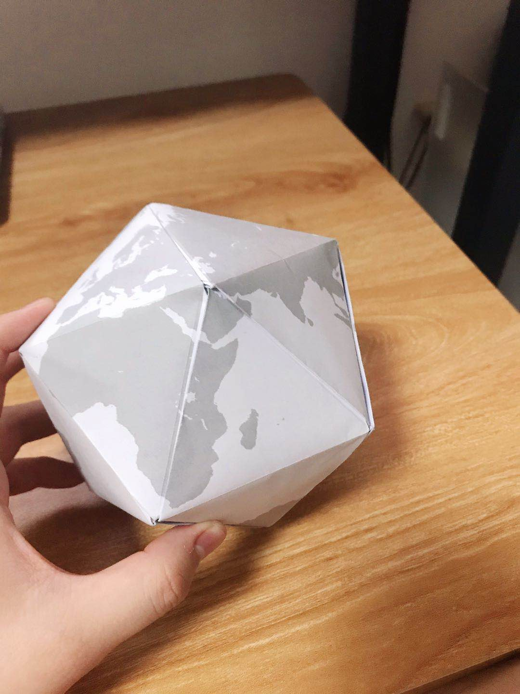

# Regular Earth

This project contains the blueprints to make a regular icosahedron earth. The size of the blueprint is same as A4 paper. To make the earth, you need 10 pieces of A4 paper.

This project is released under CC0 license. It means there is no copyright for this work is dedicated to the public domain by waiving all of my rights to the work worldwide under copyright law, including all related and neighboring rights, to the extent allowed by law.

You can copy, modify, distribute and perform the work, even for commercial purposes, all without asking permission.

Fold out along dark lines, and inward along light lines.

